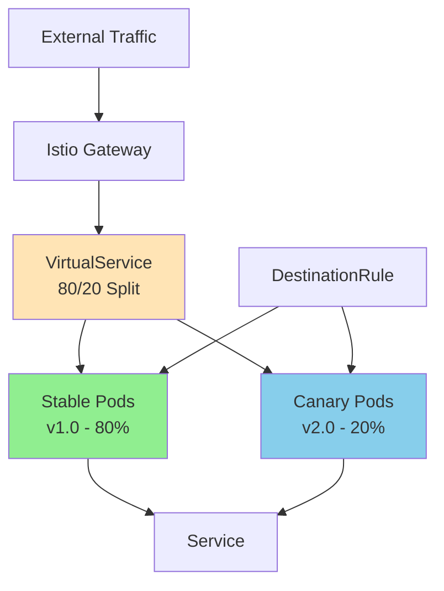
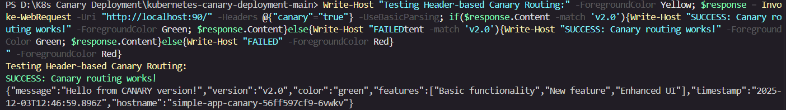
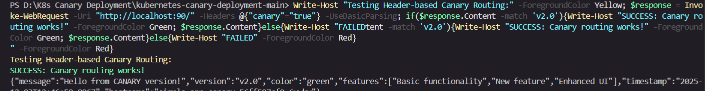

# Kubernetes Canary Deployment with Istio

A production-ready canary deployment system using Kubernetes and Istio service mesh. Deploy applications with automated traffic splitting, rollback, and promotion capabilities.

## 🚀 Features

- **80/20 Traffic Splitting** - Automatic traffic distribution between stable and canary versions
- **Header-based Routing** - Force canary routing for testing with `canary: true` header
- **Automated Scripts** - Deploy, rollback, and promote with PowerShell automation
- **Health Monitoring** - Kubernetes probes and Prometheus metrics
- **Enterprise Security** - RBAC, ConfigMaps, and Secrets

## 🏗️ Architecture



## 📋 Prerequisites

- **Kubernetes Cluster** (Docker Desktop, K3s, etc.)
- **Istio** service mesh
- **kubectl** CLI
- **Docker**

### Install Istio

```bash
# Download and install Istio
curl -L https://istio.io/downloadIstio | sh -
export PATH=$PWD/istio-1.20.1/bin:$PATH
istioctl install --set values.defaultRevision=default -y

# Verify installation
kubectl get pods -n istio-system
```

## 🚀 Quick Start

> **Note:** This project uses **port 90** for the Istio ingress gateway to avoid conflicts with other services on port 80.

### 1. Deploy Complete System

```powershell
# One-command deployment
./scripts/deploy-complete.ps1
```

### 2. Test Traffic Distribution

```powershell
# Test regular traffic (80% stable, 20% canary)
powershell -ExecutionPolicy Bypass -File test-system.ps1

# Force canary routing
Invoke-WebRequest -Uri "http://localhost:90/" -Headers @{"canary"="true"} -UseBasicParsing
```

## 🔄 Canary Workflows

### Deploy New Version

```powershell
# Deploy v3.0 with 30% traffic
./scripts/canary-deploy.ps1 -NewVersion "v3.0" -CanaryWeight 30
```

### Monitor & Decide

```powershell
# Check status
kubectl get pods -n canary-demo

# View metrics
curl http://localhost:90/metrics

# Check logs
kubectl logs -n canary-demo -l app=simple-app -f
```

### Rollback or Promote

```powershell
# Rollback if issues found
./scripts/canary-rollback.ps1

# Promote if successful
./scripts/canary-promote.ps1
```

## 📊 Application Endpoints

**Base URL**: `http://localhost:90`

| Endpoint | Purpose |
|----------|---------|
| `/` | Main app (version-specific response) |
| `/health/live` | Kubernetes liveness probe |
| `/health/ready` | Kubernetes readiness probe |
| `/metrics` | Prometheus metrics |
| `/version` | Version information |

### Example Response

```json
{
  "message": "Hello from STABLE version!",
  "version": "v1.0",
  "color": "blue",
  "features": ["Basic functionality", "Stable release"],
  "timestamp": "2025-10-06T17:30:00.000Z",
  "hostname": "simple-app-stable-7b6fb77c89-s5pmg"
}
```

## 📁 Project Structure

```
├── app/                          # Node.js application
│   ├── server.js                 # Main application code
│   ├── package.json              # Dependencies
│   └── Dockerfile                # Container definition
├── k8s/                          # Kubernetes & Istio configs
│   ├── namespace.yaml            # Namespace
│   ├── deployment-stable.yaml    # Stable deployment
│   ├── deployment-canary.yaml    # Canary deployment
│   ├── service.yaml              # K8s service
│   ├── configmap.yaml            # Configuration
│   ├── secrets.yaml              # Secrets
│   ├── rbac.yaml                 # Security
│   ├── istio-gateway.yaml        # Istio gateway
│   ├── istio-virtualservice.yaml # Traffic routing
│   └── istio-destinationrule.yaml # Load balancing
├── scripts/                      # Automation scripts
│   ├── deploy-complete.ps1       # Complete deployment
│   ├── deploy-istio.ps1          # Istio deployment helper
│   ├── build-images.sh           # Build Docker images
│   ├── canary-deploy.ps1         # Deploy canary
│   ├── canary-rollback.ps1       # Rollback
│   ├── canary-promote.ps1        # Promote
│   └── test-istio-traffic.ps1    # Traffic testing
├── test-system.ps1               # System validation tests
├── test-simple.ps1               # Simple tests
└── README.md                     # This file
```

## ⚙️ Configuration

### Adjust Traffic Weights

Edit `k8s/istio-virtualservice.yaml`:

```yaml
route:
- destination:
    host: simple-app
    subset: stable
  weight: 80  # Stable percentage
- destination:
    host: simple-app
    subset: canary
  weight: 20  # Canary percentage
```

### Environment Settings

Modify `k8s/configmap.yaml`:

```yaml
data:
  LOG_LEVEL: "info"
  FEATURE_NEW_UI: "false"
  MAX_CONNECTIONS: "1000"
```

## 🔍 Troubleshooting

### Check System Status

```powershell
# Verify all components
kubectl get all -n canary-demo
kubectl get gateway,virtualservice,destinationrule -n canary-demo

# Check Istio sidecars (should show 2/2 containers)
kubectl get pods -n canary-demo
```

### Common Issues

| Issue | Solution |
|-------|----------|
| Pods not starting | `kubectl describe pods -n canary-demo` |
| No traffic splitting | Check Istio sidecar injection |
| App not accessible | Verify Istio gateway configuration |
| Metrics not working | Check `/metrics` endpoint directly |

### Test Commands

```powershell
# Health checks
curl http://localhost:90/health/live
curl http://localhost:90/health/ready

# Traffic distribution
powershell -ExecutionPolicy Bypass -File test-system.ps1

# Force canary
curl -H "canary: true" http://localhost:90/
```

## 📈 Monitoring

The system provides basic observability:

- **Metrics Endpoint** - Prometheus-compatible format at `/metrics`
- **Structured Logging** - JSON logs with request tracking
- **Health Probes** - Kubernetes liveness/readiness checks
- **Traffic Analysis** - Built-in testing scripts

> **Note:** This project provides metrics in Prometheus format but doesn't include a Prometheus server. You can add Prometheus/Grafana separately to scrape and visualize these metrics.

## 📸 Proof of Work

### System Validation Test Results



**Test Results Summary:**
- ✅ **Pod Status**: All pods running with Istio sidecars (2/2 containers)
- ✅ **Health Endpoints**: Liveness and readiness probes operational
- ✅ **Traffic Distribution**: Working as expected
- ✅ **Header-based Routing**: SUCCESS - Canary routing functional
- ✅ **Istio Resources**: Gateway, VirtualService, DestinationRule configured

### Traffic Distribution Test



**Traffic Split Results:**
- **Stable (v1.0)**: 7 requests (70%)
- **Canary (v2.0)**: 3 requests (30%)
- **Target**: 80% stable, 20% canary ✅ **Within acceptable range**
- **Header Routing**: 100% success rate for forced canary routing

> These screenshots demonstrate the working canary deployment system with proper traffic splitting, health monitoring, and Istio service mesh integration.
# Created by Dhruv Ag - 9/12/25 
